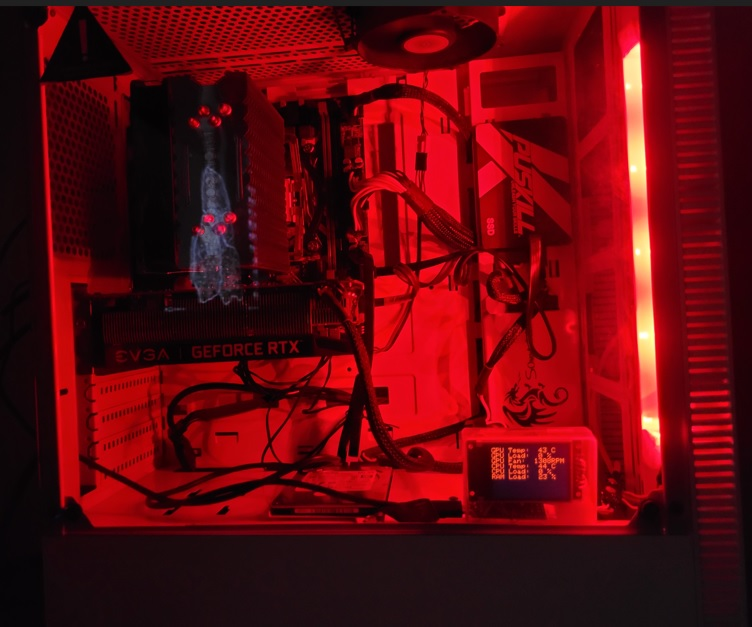
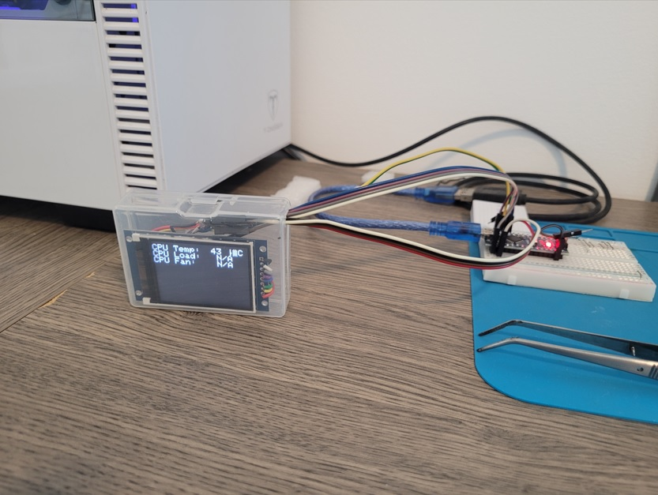
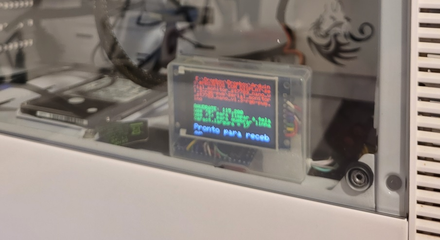

# stats-display-arduino
Show PC temperature and usage in a small OLED or TFT display using Arduino and OpenHardwareMonitor

# PC Hardware Monitor - OLED/TFT Display 🖥️🌡️

A custom hardware monitoring solution that displays real-time CPU/GPU temperatures and usage from your Windows PC onto an external OLED or TFT screen connected via Arduino.

---

## 🚀 Features
* **Real-time Monitoring:** Tracks CPU and GPU load/temperature.
* **Hardware Agnostic:** Uses OpenHardwareMonitor to fetch data.
* **Auto-Detection:** Generates a `sensors.txt` file to help you map your specific PC hardware sensors.
* **Admin Mode:** Support for elevated privileges to unlock more sensor data (Fan speeds, advanced voltage, etc.).
* **No Python Needed:** Includes a pre-compiled `.exe` for quick setup (see limitations below).

---

## 🛠️ Hardware Requirements
* **Microcontroller:** Arduino (Uno, Nano, or Pro Micro).
* **Display:** SSD1306 OLED (128x64) or any TFT supported by your code.
* **Connection:** USB Cable for Serial communication.

---

## 📋 How it Works
1. **Windows Side (Python):** A script runs in the background, communicating with the OpenHardwareMonitor API. It gathers the sensor data and sends it through the **Serial Port (USB)** to the Arduino.
2. **Arduino Side:** The microcontroller receives the data string, parses it, and displays it on the screen.

---

## 🔧 Setup & Customization

### 1. Identify your Sensors
Every PC has a different hardware configuration. To ensure you are tracking the right components:
* Get the OpenHardwareMonitor DLL file in the same folder: OpenHardwareMonitorLib.dll
* Run the script (or `.exe`) as **Administrator**.
* A file named `sensors.txt` will be automatically generated in the root folder.
* Open this file to find the exact names or IDs of your CPU/GPU sensors.

### 2. Python Configuration
If the `.exe` doesn't match your sensor IDs, you can run the source code:
* Install requirements: `pip install wmi` (and any other library used).
* Edit the `main.py` file to match the sensors found in your `sensors.txt`.
* Set your **COM Port** (e.g., `COM3`) or it will find an Arduino connected to the computer.

### 3. Arduino Flash
* Open the `.ino` file in the Arduino IDE.
* Install required libraries (e.g., `Adafruit_SSD1306`).
* Upload the code to your board.

---

## 📦 Dependencies & Credits

This project relies on the following third-party software:

* **[OpenHardwareMonitor](https://openhardwaremonitor.org/):** A free open-source software that monitors temperature sensors, fan speeds, voltages, load and clock speeds of a computer. 
    * *Note: OpenHardwareMonitor DLL must be available for this program to work.*
  
---

## ⚠️ Important Notes
* **Admin Rights:** For the best experience, run the program as **Administrator**. This allows the tool to access low-level hardware sensors (like GPU temperature) that Windows normally restricts.
* **The .exe File:** The included executable is a portable version. If your hardware IDs differ significantly from the original setup, you may need to run the Python script directly to adjust the mapping.

---

## 🤝 Contributing
Contributions, issues, and feature requests are welcome! Feel free to check the issues page.
